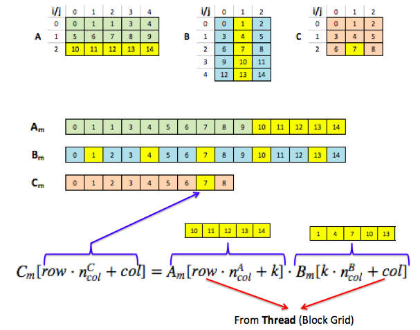

### Matrix Multiplication

$$c_{ij} = \sum_{k=0}^{K-1} a_{ik} b_{kj}$$

- Matrices $A$ and $B$ are stored in devices' (GPU) global memory in **row-major** order
- If multiplying $100 \times 200$ by $200 \times 300$ matrix then $30,000$ threads will be launched to compute entries of $100 \times 300$ product matrix. NOTE: Must launch enough threads to cover all the entries of product matrix
- **First thing threads do is to locate themselves relative to product matrix**
- `if (row > A.nrows || col > B.ncols) { return ; }` - The thread is terminated if its `row` or `col` places it outside the bounds of product matrix

**Example**

- $A$: $3 \times 5$ matrix, $n_{col}^{A} = 5$ and $A_m$: Matrix $A$ stored in *row-major* order in GPU global memory
- $B$: $5 \times 3$ matrix, $n_{col}^{B} = 3$ and $B_m$: Matrix $B$ stored in *row-major* order in GPU global memory
- $C$ (product matrix): $3 \times 3$ matrix, $n_{col}^{C} = 3$ and $C_m$: Matrix $C$ stored in *row-major* order in GPU global memory
- $k = 0, 1, 2, 3, 4$ 

